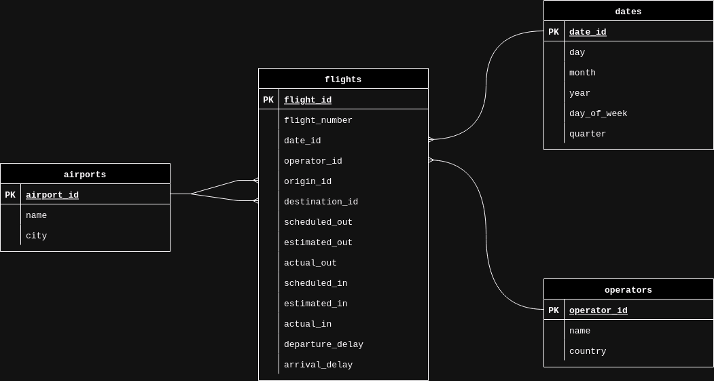

#  Flights ETL

Este pipeline de ETL procesa datos de vuelos comerciales. Obtiene información de una API, realiza algunas transformaciones y modificaciones, y finalmente almacena los datos en una base de datos.

## Pasos

- **Extracción**: Se obtienen datos relacionados a vuelos comerciales para un aeropuerto y rango de tiempo dado utilizando la API [AeroAPI](https://www.flightaware.com/commercial/aeroapi/) de la empresa FlightAware. 
- **Transformacion**: Se procesan los datos obtenidos, extrayendo campos relevantes y combinándolos con información de un archivo local para generar tablas de interés.
- **Carga**: Las tablas generadas en el paso anterior se almacenan en una base de datos de AWS Redshift.


## Base de Datos
El diagrama de la base de datos generada y alojada en Redshift sigue un modelo de estrella:



- La tabla de hechos 'flights' contiene información detallada sobre cada vuelo (ID, número, fechas, horas programadas/estimadas, etc.).

- Las tablas de dimensiones contienen los IDs de referencia utilizados por la tabla 'flights' y el detalle de los campos.

## Ejecutar el ETL

Para ejecutar el pipeline es necesario tener instalados Python y Docker Compose y luego seguir los pasos a continuación.

#### 1. Clonar repositorio

```bash
git clone https://github.com/guidocaru/flights-etl
cd flights-etl
```

#### 2. Configurar variables de entorno
Definir las variables de entorno en un archivo `.env`

```bash
# airflow
AIRFLOW_UID=1000

# api
API_URL=
API_KEY=

# redshift 
REDSHIFT_PASSWORD=
REDSHIFT_HOST=
REDSHIFT_PORT=
REDSHIFT_DB=
REDSHIFT_USER=
REDSHIFT_SCHEMA=
```

#### 3. Levantar Airflow

Para instalar ejecutar el Dockerfile que instala dependencias e inicia el webserver de Airflow, ejecutar los siguientes comandos.

```bash
docker compose up airflow-init
docker compose up -d
```

#### 4. Acceder al servidor

Visitar http://localhost:8080 e iniciar sesión con 'airflow' como usuario y contraseña.

#### 5. Ejecutar el pipeline

Localizar el DAG 'flights-etl' y ejecutarlo.
